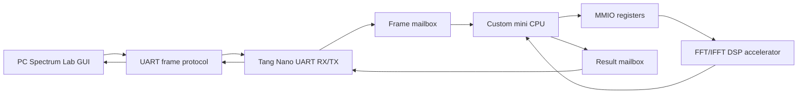

# FPGA Audio Platform

FPGA Audio Platform to projekt demonstratora DSP dla płytki Sipeed Tang Nano
20K. Aktualna wersja jest sprawdzalnym systemem blokowego przetwarzania audio:
komputer PC generuje ramkę 256 próbek, wysyła ją przez UART do FPGA, a FPGA
przetwarza ramkę w stałoprzecinkowym torze FFT/IFFT sterowanym przez własny mini
CPU. Wynik wraca przez UART do aplikacji PC, gdzie można go porównać z lokalną
symulacją i wyeksportować do CSV.

To nie jest jeszcze kompletny system wejścia/wyjścia audio w czasie
rzeczywistym. Obecnie nie jest używany fizyczny tor I2S z ADC/DAC
PCM1808/PCM5102A. Działający i przetestowany tryb demonstracyjny jest
frame-based: PC wysyła próbki, FPGA liczy jedną ramkę, PC odbiera wynik.

## Najważniejsze funkcje

- PC Spectrum Lab GUI do generowania sygnału, ustawiania modyfikacji widma,
  wyboru backendu i oglądania wykresów.
- Lokalna symulacja float po stronie PC.
- Mock FPGA backend do testowania protokołu bez sprzętu.
- Serial FPGA backend do komunikacji z Tang Nano 20K przez UART.
- Protokół ramek UART z komendami `PING`, `SET_GAINS`,
  `WRITE_FRAME_CHUNK`, `RUN_FRAME`, `GET_STATUS`, `READ_RESULT_CHUNK`.
- Top sprzętowy `tang_cpu_owned_frame_uart_top`.
- Własny mini CPU soft-core z programem w ROM.
- CPU-owned flow: tylko mini CPU steruje akceleratorem FFT/IFFT przez MMIO.
- Akcelerator FFT/IFFT z buforami wejścia/wyjścia, rejestrami statusu i
  procesorem pasm `BASS`, `MID`, `TREBLE`.
- Stałoprzecinkowy tor DSP: signed int16 dla próbek, Q2.14 dla gainów.
- Testy Python, testy Verilog, testy CSV/fixed-point i GitHub Actions.

## Architektura w skrócie



Pełny przepływ danych:

```text
PC Spectrum Lab application
    -> UART frame protocol
    -> Tang Nano 20K FPGA
    -> UART RX/TX
    -> frame mailbox
    -> custom mini CPU soft-core
    -> MMIO
    -> FFT/IFFT fixed-point DSP accelerator
    -> frame result
    -> UART back to PC
    -> GUI plots and CSV export
```

## Aktualne ograniczenia

- System nie działa jeszcze jako fizyczny realtime audio ADC -> FPGA -> DAC.
- Aktualnie używany demonstrator nie używa fizycznego I2S audio input/output.
- PC generuje sygnał testowy i wysyła próbki do FPGA przez UART.
- FPGA przetwarza ramkę 256 próbek i odsyła wynik do PC.
- Sprzętowy model modyfikacji widma ma trzy uproszczone pasma:
  `BASS`, `MID`, `TREBLE`.
- Gain jest signed Q2.14, więc zakres to `-2.0 .. +1.99994`.
- Gain większy niż około `+2.0` ulega saturacji do wartości bliskiej `2.0`.
- Jeśli kilka modyfikacji GUI trafia do tego samego pasma sprzętowego, działa
  zasada "last one wins".
- Te zachowania są oczekiwanymi ograniczeniami obecnej implementacji, a nie
  błędami.

## Hardware

Docelową płytką dla obecnego bring-upu jest Sipeed Tang Nano 20K z układem
Gowin GW2AR-18. Aktualny top sprzętowy:

```text
rtl/top/tang_cpu_owned_frame_uart_top.v
```

Potwierdzone przypisania dla pierwszego testu przez onboard BL616 USB-UART:

| Sygnał | Pin | Znaczenie |
| --- | ---: | --- |
| `clk` | 4 | zegar płytki |
| `led` | 15 | status LED, aktywne niskim poziomem |
| `uart_tx` | 69 | `SYS_TX`, dane z FPGA do PC |
| `uart_rx` | 70 | `SYS_RX`, dane z PC do FPGA |

Szczegóły są w [docs/tang_nano_hardware.md](docs/tang_nano_hardware.md).

## Uruchomienie aplikacji PC

```powershell
python tools/spectrum_lab_app.py
```

W GUI można wybrać:

- `Local simulation` - idealna symulacja float po stronie PC,
- `Mock FPGA backend` - loopback protokołu bez DSP,
- `Serial FPGA backend` - realna komunikacja z Tang Nano przez UART.

GUI pokazuje sześć wykresów: wejście, lokalny wynik float, wynik mock, wynik
serial, różnicę mock-local i różnicę serial-local. Pokazuje też metryki błędu:
`max abs error`, `mean abs error`, `RMS error`.

## Uruchomienie klienta UART

Mock bez sprzętu:

```powershell
python tools/spectrum_lab_uart_client.py --mock
```

Realny port COM po zaprogramowaniu Tang Nano:

```powershell
python tools/spectrum_lab_uart_client.py --port COM6
```

Numer portu COM zależy od komputera. W Windows sprawdź go w Menedżerze urządzeń.

## Test sprzętowy Tang Nano 20K

1. Otwórz projekt w Gowin EDA.
2. Ustaw top module: `tang_cpu_owned_frame_uart_top`.
3. Użyj constraints dla `clk`, `led`, `uart_tx`, `uart_rx` zgodnych z pinami
   powyżej.
4. Uruchom `Synthesize`.
5. Uruchom `Place & Route`.
6. Uruchom `Generate Bitstream`.
7. Zaprogramuj płytkę przez `SRAM Program`.
8. Uruchom:

```powershell
python tools/spectrum_lab_uart_client.py --port COM6
python tools/spectrum_lab_app.py
```

W GUI wybierz `Serial FPGA backend`.

## Testy

Pełny lokalny runner:

```powershell
python tools/run_all_tests.py
```

Wybrane testy PC:

```powershell
python tools/test_spectrum_lab_model.py
python tools/test_spectrum_lab_hardware_backend.py
python tools/test_fpga_fixed_point_reference_calibration.py
python tools/spectrum_lab_uart_client.py --mock
```

GitHub Actions uruchamia testy dla pull requestów do `fpga-only-fft-console`.

## Struktura projektu

| Ścieżka | Rola |
| --- | --- |
| `rtl/` | główne źródła RTL |
| `rtl/top/` | top-level moduły FPGA |
| `rtl/cpu/` | własny mini CPU i ROM programu |
| `rtl/uart/` | UART RX/TX, parser ramek i mailbox |
| `rtl/control/` | rejestry MMIO i wrapper akceleratora |
| `rtl/dsp/` | FFT/IFFT, spectral processor, fixed-point DSP |
| `tools/` | aplikacja PC, klient UART, modele i testy Python |
| `tb/` | testbenche Verilog |
| `gowin_impl/` | projekt Gowin i kopie źródeł do bitstreamu |
| `vendor/` | miejsce na przyszłe vendor/IP |
| `docs/` | końcowa dokumentacja projektu |

## Dokumentacja szczegółowa

Zacznij od [docs/README.md](docs/README.md). Najważniejsze dokumenty:

- [docs/architecture.md](docs/architecture.md)
- [docs/requirements_and_functionality.md](docs/requirements_and_functionality.md)
- [docs/problem_analysis.md](docs/problem_analysis.md)
- [docs/pc_application.md](docs/pc_application.md)
- [docs/uart_protocol.md](docs/uart_protocol.md)
- [docs/mini_cpu.md](docs/mini_cpu.md)
- [docs/fft_dsp_accelerator.md](docs/fft_dsp_accelerator.md)
- [docs/fixed_point_model.md](docs/fixed_point_model.md)
- [docs/tang_nano_hardware.md](docs/tang_nano_hardware.md)
- [docs/testing_and_validation.md](docs/testing_and_validation.md)
- [docs/design_patterns.md](docs/design_patterns.md)
- [docs/maintenance_and_deployment.md](docs/maintenance_and_deployment.md)
- [docs/bibliography.md](docs/bibliography.md)

## Status implementacji

Zaimplementowane i testowane:

- PC Spectrum Lab GUI,
- UART frame protocol,
- mock i serial backend,
- Tang Nano UART top,
- frame mailbox,
- mini CPU soft-core,
- program ROM z service loop,
- MMIO akceleratora,
- FFT/IFFT fixed-point DSP accelerator,
- BASS/MID/TREBLE spectral gain,
- fixed-point model i testy porównawcze,
- GitHub Actions.

Niezaimplementowane w aktualnym demonstratorze:

- real-time fizyczny tor PCM1808 -> FPGA -> PCM5102A,
- fizyczne I2S audio input/output dla obecnego pipeline,
- AXI-Lite,
- pełny system operacyjny albo RISC-V,
- arbitralne niezależne filtry float w FPGA,
- streaming audio bez ramek PC/UART.
