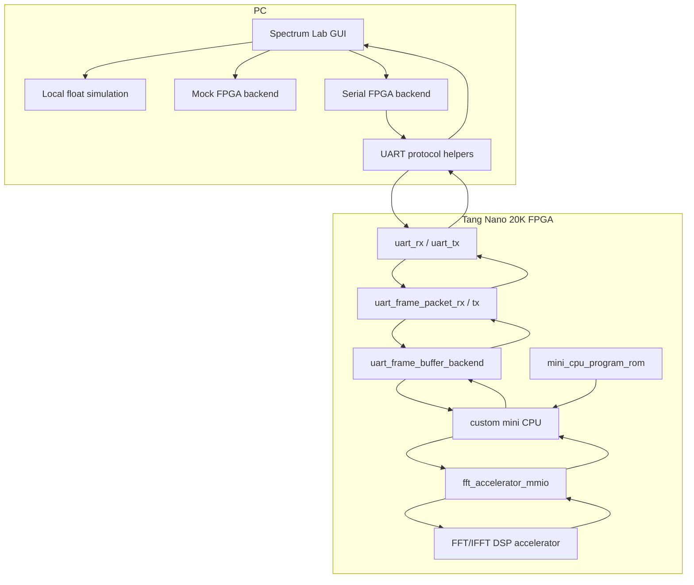
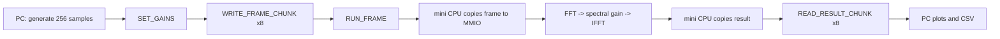
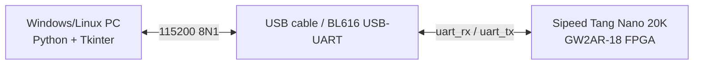
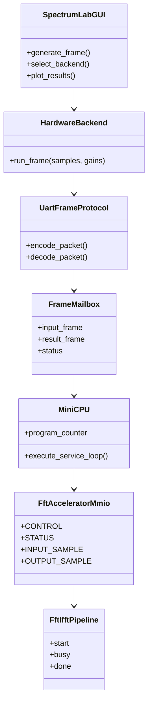

# Architektura systemu

Aktualna wersja projektu jest blokowym demonstratorem DSP na FPGA. Komputer PC
generuje ramkę 256 próbek, wysyła ją przez UART do Tang Nano 20K, a FPGA
przetwarza ramkę w stałoprzecinkowym torze FFT/IFFT. Wynik wraca do PC i jest
porównywany z lokalną symulacją.

## Komponenty



## Przepływ danych



## Top FPGA

Główny top sprzętowy dla aktualnego systemu:

```text
rtl/top/tang_cpu_owned_frame_uart_top.v
```

Top łączy:

- bitowy `uart_rx`,
- bitowy `uart_tx`,
- parser i formatter ramek UART,
- `uart_frame_buffer_backend`,
- `mini_cpu_uart_frame_system`,
- aktywną niskim poziomem diodę statusu.

## Odpowiedzialność modułów

| Warstwa | Odpowiedzialność |
| --- | --- |
| PC GUI | generuje sygnał, uruchamia backendy, rysuje wykresy |
| UART protocol | pakuje 256 próbek w małe komendy i odpowiedzi |
| UART RTL | zamienia bajty na ramki i ramki na bajty |
| Mailbox | przechowuje ramkę wejściową, gainy, status i wynik |
| mini CPU | jedyny właściciel sterowania `fft_accelerator_mmio` |
| MMIO | udostępnia rejestry i pamięci próbek dla CPU |
| FFT/IFFT DSP | wykonuje przetwarzanie fixed-point ramki |

## Diagram deployment



## Diagram UML zależności modułów



## Granice aktualnej architektury

System nie odbiera jeszcze próbek z fizycznego ADC i nie wysyła ich do fizycznego
DAC. Fizyczny tor PCM1808/PCM5102A jest przyszłą warstwą sprzętową. Obecnie
źródłem danych jest PC, a komunikacja z FPGA odbywa się przez UART.
