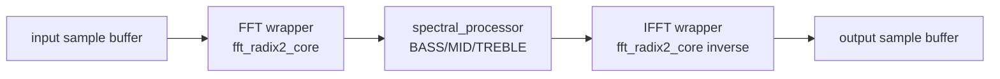

# Akcelerator FFT/IFFT DSP

Akcelerator przetwarza ramkę 256 próbek. Jest sterowany przez rejestry MMIO
i pracuje w modelu `START` -> `BUSY` -> `DONE`.

To jest przetwarzanie ramkowe i sekwencyjne. Aktualny system nie jest ciągłym,
jednopróbkowym pipeline realtime audio. Opóźnienie jest opóźnieniem całej ramki:
CPU zapisuje dane, uruchamia akcelerator, czeka na `DONE`, a dopiero potem czyta
wynik.

## Główne pliki

```text
rtl/control/fft_mmio_regs.v
rtl/control/fft_accelerator_mmio.v
rtl/dsp/fft_ifft_pipeline.v
rtl/dsp/fft_accel_wrapper.v
rtl/dsp/ifft_accel_wrapper.v
rtl/dsp/fft_radix2_core.v
rtl/dsp/spectral_processor.v
rtl/dsp/spectral_gain_select.v
```

## Pipeline



Aktualne przetwarzanie FFT/IFFT używa własnego rdzenia RTL radix-2:

```text
rtl/dsp/fft_radix2_core.v
```

Gowin FFT IP nie jest aktywnym backendem w obecnym działającym systemie.

## Model pracy ramkowej

Parametry aktualnego flow:

- rozmiar ramki wejściowej: 256 próbek signed int16,
- wejście dla FFT: część rzeczywista = próbka, część urojona = 0,
- gainy pasmowe: signed Q2.14,
- wynik końcowy: signed int16 z saturacją.

Sekwencja sprzętowa:

```text
CPU writes INPUT_SAMPLE[0..255]
CPU writes BASS/MID/TREBLE gains
CPU writes CONTROL.START
accelerator asserts BUSY
FFT -> spectral gain -> IFFT
accelerator asserts DONE
CPU reads OUTPUT_SAMPLE[0..255]
```

UART i service loop mini CPU służą do laboratoryjnego przetwarzania ramek oraz
demonstracji PC -> FPGA -> PC. Obecna implementacja nie jest procesorem
strumieniowego audio I2S.

## Rejestry MMIO

Adresy poniżej są adresami widzianymi przez wrapper `fft_mmio_regs.v`.
System CPU mapuje je od bazy `0x9000`.

| Adres | Nazwa | Opis |
| ---: | --- | --- |
| `0x0000` | `CONTROL` | bit 0 `START`, bit 1 `CLEAR` |
| `0x0001` | `STATUS` | bit 0 `BUSY`, bit 1 `DONE`, bit 2 `OVERFLOW`, bit 3 `ERROR` |
| `0x0002` | `MODE` | rejestr trybu, obecnie diagnostyczny |
| `0x0003` | `BASS_GAIN` | signed Q2.14 |
| `0x0004` | `MID_GAIN` | signed Q2.14 |
| `0x0005` | `TREBLE_GAIN` | signed Q2.14 |
| `0x0006` | `DEBUG` | wersja/debug |
| `0x0100..0x01FF` | `INPUT_SAMPLE` | 256 próbek wejściowych |
| `0x0200..0x02FF` | `OUTPUT_SAMPLE` | 256 próbek wyjściowych |

## Co FPGA naprawdę liczy

Aktualny tor sprzętowy:

1. CPU zapisuje 256 próbek signed int16 do pamięci wejściowej.
2. CPU zapisuje gainy `BASS`, `MID`, `TREBLE`.
3. CPU ustawia `CONTROL.START`.
4. `fft_accelerator_mmio` podaje próbki do `fft_ifft_pipeline`.
5. FFT generuje widmo zespolone.
6. `spectral_processor` wybiera pasmo dla indeksu binu i mnoży real/imag przez
   odpowiedni gain Q2.14.
7. IFFT wraca do dziedziny czasu.
8. Wynik jest saturacją ograniczony do signed int16.
9. `STATUS.DONE` informuje CPU, że wynik jest gotowy.

## `spectral_gain_select.v`

`rtl/dsp/spectral_gain_select.v` upraszcza modyfikację widma:

- zamienia indeks FFT na efektywny indeks dodatniej częstotliwości,
- uwzględnia symetrię widma przez `min(bin_index, FFT_SIZE - bin_index)`,
- przypisuje bin do pasma `BASS`, `MID` albo `TREBLE`,
- wybiera odpowiedni gain Q2.14.

Aktualny podział pasm:

```text
BASS   effective_bin <= 1
MID    effective_bin 2..21
TREBLE effective_bin >= 22
```

Dzięki temu sprzęt nie musi przechowywać osobnego gainu dla każdego binu, a mimo
to można pokazać pełny przepływ sterowania widmem.

## Status i błędy

`STATUS` zawiera informację o pracy pipeline, zakończeniu, overflow i błędzie.
Start podczas aktywnego `BUSY` jest raportowany jako rejected start w testach
wrappera MMIO. `CLEAR` kasuje zalatchowane statusy i pamięć wyjściową.
