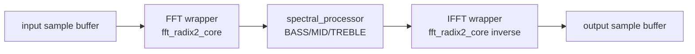

# Akcelerator FFT/IFFT DSP

Akcelerator przetwarza ramkę 256 próbek. Jest sterowany przez rejestry MMIO i
pracuje w modelu `START` -> `BUSY` -> `DONE`.

## Główne pliki

```text
rtl/control/fft_mmio_regs.v
rtl/control/fft_accelerator_mmio.v
rtl/dsp/fft_ifft_pipeline.v
rtl/dsp/fft_accel_wrapper.v
rtl/dsp/ifft_accel_wrapper.v
rtl/dsp/fft_radix2_core.v
rtl/dsp/spectral_processor.v
rtl/dsp/spectral_gain_select.v
```

## Pipeline



## Rejestry MMIO

| Adres | Nazwa | Opis |
| ---: | --- | --- |
| `0x0000` | `CONTROL` | `START`, `CLEAR` |
| `0x0001` | `STATUS` | `BUSY`, `DONE`, `OVERFLOW`, `ERROR` |
| `0x0002` | `MODE` | rejestr trybu, obecnie diagnostyczny |
| `0x0003` | `BASS_GAIN` | Q2.14 |
| `0x0004` | `MID_GAIN` | Q2.14 |
| `0x0005` | `TREBLE_GAIN` | Q2.14 |
| `0x0006` | `DEBUG` | wersja/debug |
| `0x0100..0x01FF` | `INPUT_SAMPLE` | 256 próbek wejściowych |
| `0x0200..0x02FF` | `OUTPUT_SAMPLE` | 256 próbek wyjściowych |

## Co FPGA naprawdę liczy

Aktualny tor sprzętowy:

1. CPU zapisuje 256 próbek signed int16 do pamięci wejściowej.
2. CPU zapisuje gainy `BASS`, `MID`, `TREBLE`.
3. CPU ustawia `CONTROL.START`.
4. Wrapper podaje próbki do `fft_ifft_pipeline`.
5. FFT generuje widmo zespolone.
6. `spectral_processor` wybiera pasmo dla indeksu binu i mnoży real/imag przez
   odpowiedni gain Q2.14.
7. IFFT wraca do dziedziny czasu.
8. Wynik jest saturacją ograniczony do signed int16.
9. `STATUS.DONE` informuje CPU, że wynik jest gotowy.

## Pasmowe uproszczenie sprzętowe

FPGA nie implementuje dowolnych niezależnych filtrów float z GUI. Używa trzech
gainów:

```text
BASS   effective_bin <= 1
MID    effective_bin 2..21
TREBLE effective_bin >= 22
```

Jeśli kilka modyfikacji GUI mapuje się na ten sam hardware band, do FPGA trafia
ostatnia wartość gainu dla tego pasma.

## Status i błędy

`STATUS` zawiera informację o pracy pipeline, zakończeniu, overflow i błędzie.
Start podczas aktywnego `BUSY` jest raportowany jako błąd/rejected start w
testach wrappera MMIO.
