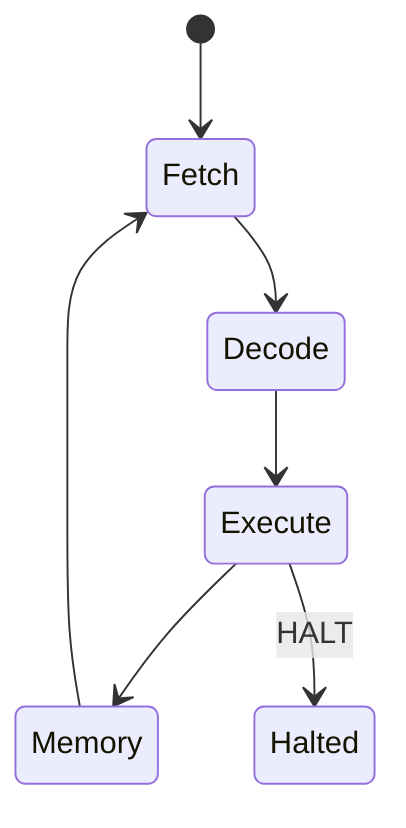

# Własny mini CPU

Projekt używa własnego mini CPU soft-core napisanego w Verilogu. Nie jest to
ARM, RISC-V, STM32 ani gotowy procesor zewnętrzny. Jest to prosty procesor
edukacyjny z licznikiem programu, rejestrami, instrukcjami load/store,
skokami i interfejsem do magistrali pamięciowo-mapowanej.

## Najważniejsze pliki

```text
rtl/cpu/mini_cpu_core.v
rtl/cpu/mini_cpu_defs.vh
rtl/cpu/mini_cpu_program_rom.v
rtl/cpu/mini_cpu_uart_frame_system.v
```

`mini_cpu_defs.vh` definiuje opkody i identyfikatory programów. Aktualny program
domyślny dla flow UART frame to:

```text
MINI_CPU_PROGRAM_UART_FRAME_SERVICE
```

`mini_cpu_program_rom.v` zawiera program w postaci stałej pamięci ROM. Zmiana
programu CPU wymaga przebudowania bitstreamu.

## Cykl działania CPU



W aktualnym programie service loop CPU nie kończy pracy po jednej ramce. Po
obsłużeniu sukcesu lub błędu wraca do stanu oczekiwania na kolejne `RUN_FRAME`.

## Service loop

Pseudokod aktualnego programu:

```text
while true:
    wait for RUN_FRAME
    acknowledge request
    set busy
    write gains to FFT MMIO
    copy FRAME_INPUT_SAMPLE[0..255] to FFT_INPUT_SAMPLE[0..255]
    write CONTROL.START
    wait for STATUS.DONE or STATUS.ERROR
    copy FFT_OUTPUT_SAMPLE[0..255] to FRAME_RESULT_SAMPLE[0..255]
    set DONE/PASS status
    return to idle
```

## MMIO i własność akceleratora

Najważniejsza reguła architektoniczna:

```text
Only the mini CPU controls fft_accelerator_mmio.
```

UART backend jest mailboxem. Może zapisać ramkę, gainy i request, ale nie może
bezpośrednio uruchamiać ani odpytywać akceleratora FFT/IFFT. Dzięki temu system
ma czytelny podział odpowiedzialności: PC komunikuje się protokołem ramek, a CPU
realizuje sterowanie sprzętowe.

## Mapa adresów używana przez system CPU UART frame

| Zakres | Znaczenie |
| --- | --- |
| `0x8000` | wynik GPIO/debug |
| `0x8020` | status CPU |
| `0x9000..0x9006` | rejestry FFT MMIO |
| `0x9100..0x91FF` | wejściowa pamięć próbek FFT |
| `0x9200..0x92FF` | wyjściowa pamięć próbek FFT |
| `0xA000..0xA005` | rejestry mailboxa UART |
| `0xA100..0xA1FF` | ramka wejściowa z UART |
| `0xA200..0xA2FF` | ramka wynikowa dla UART |

## Dlaczego to jest CPU

Mini CPU ma realny program counter, pobiera instrukcje z ROM, dekoduje opkody,
wykonuje operacje ALU, load/store i skoki warunkowe. Nie jest to tylko FSM
zaszyty w jednym module. Dzięki temu można testować programy CPU osobno i
zmieniać zachowanie sterowania przez zmianę ROM.
