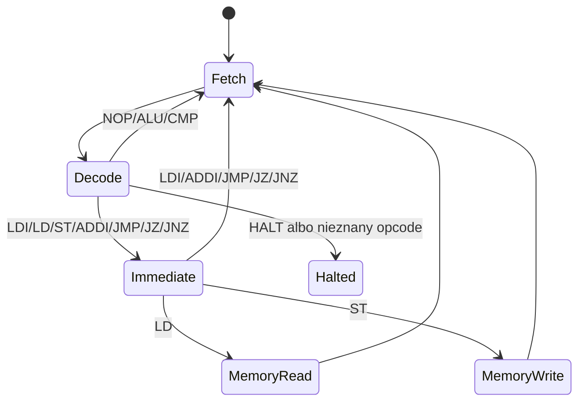
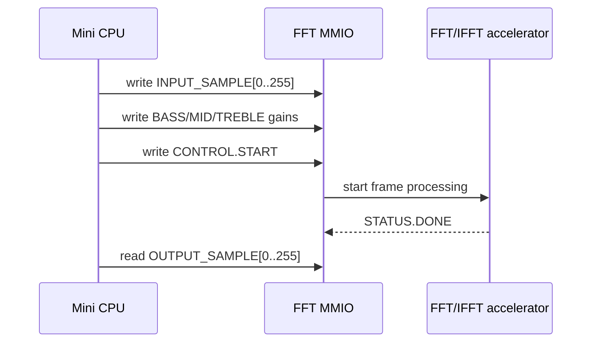

# Mini CPU

Projekt używa własnego mini CPU soft-core napisanego w Verilogu. Jest to prosty
procesor edukacyjny z licznikiem programu, ośmioma rejestrami ogólnego
przeznaczenia, instrukcjami load/store, skokami i interfejsem do magistrali
pamięciowo-mapowanej.

## Najważniejsze pliki

```text
rtl/cpu/mini_cpu_core.v
rtl/cpu/mini_cpu_defs.vh
rtl/cpu/mini_cpu_program_rom.v
rtl/cpu/mini_cpu_uart_frame_system.v
```

`mini_cpu_defs.vh` definiuje opkody i identyfikatory programów. Aktualny program
domyślny dla flow UART frame to:

```text
MINI_CPU_PROGRAM_UART_FRAME_SERVICE
```

`mini_cpu_program_rom.v` zawiera program w postaci stałej pamięci ROM. Zmiana
programu CPU wymaga przebudowania bitstreamu.

## Instrukcje

Poniższa tabela jest oparta o `rtl/cpu/mini_cpu_defs.vh` oraz wykonanie
w `rtl/cpu/mini_cpu_core.v`.

| Mnemonic | Rola | Uwagi |
| --- | --- | --- |
| `NOP` | brak operacji | przejście do następnej instrukcji |
| `LDI` | load immediate | ładuje kolejne słowo ROM do rejestru `rd` |
| `LD` | load z magistrali | kolejne słowo ROM jest adresem odczytu |
| `ST` | store do magistrali | kolejne słowo ROM jest adresem zapisu |
| `ADD` | dodawanie rejestrów | `rd = rd + rs`, aktualizuje `zero_flag` |
| `ADDI` | dodawanie immediate | `rd = rd + immediate`, aktualizuje `zero_flag` |
| `SUB` | odejmowanie rejestrów | `rd = rd - rs`, aktualizuje `zero_flag` |
| `AND` | bitowe AND | `rd = rd & rs`, aktualizuje `zero_flag` |
| `CMP` | porównanie | wykonuje `rd - rs`, ustawia tylko `zero_flag` |
| `JMP` | skok bezwarunkowy | kolejne słowo ROM jest adresem skoku |
| `JZ` | skok jeśli zero | skok, gdy `zero_flag = 1` |
| `JNZ` | skok jeśli nie zero | skok, gdy `zero_flag = 0` |
| `HALT` | zatrzymanie | ustawia `halted` i pozostaje w stanie `STATE_HALT` |

Instrukcje z argumentem immediate zajmują dwa słowa ROM: pierwsze z opkodem,
drugie z wartością albo adresem.

## Cykl działania CPU



W aktualnym programie service loop CPU nie kończy pracy po jednej ramce. Po
obsłużeniu sukcesu lub błędu wraca do stanu oczekiwania na kolejne `RUN_FRAME`.

## Service loop

Pseudokod aktualnego programu:

```text
while true:
    wait for RUN_FRAME
    acknowledge request
    set busy
    write gains to FFT MMIO
    copy FRAME_INPUT_SAMPLE[0..255] to FFT_INPUT_SAMPLE[0..255]
    write CONTROL.START
    wait for STATUS.DONE or STATUS.ERROR
    copy FFT_OUTPUT_SAMPLE[0..255] to FRAME_RESULT_SAMPLE[0..255]
    set DONE/PASS status
    return to idle
```

## MMIO i własność akceleratora

Najważniejsza reguła architektoniczna:

```text
Only the mini CPU controls fft_accelerator_mmio.
```

UART backend jest mailboxem. Może zapisać ramkę, gainy i request, ale nie może
bezpośrednio uruchamiać ani odpytywać akceleratora FFT/IFFT. Dzięki temu system
ma czytelny podział odpowiedzialności: PC komunikuje się protokołem ramek, a CPU
realizuje sterowanie sprzętowe.



## Mapa adresów używana przez system CPU UART frame

| Zakres | Znaczenie |
| --- | --- |
| `0x8000` | wynik GPIO/debug |
| `0x8020` | status CPU |
| `0x9000..0x9006` | rejestry FFT MMIO |
| `0x9100..0x91FF` | wejściowa pamięć próbek FFT |
| `0x9200..0x92FF` | wyjściowa pamięć próbek FFT |
| `0xA000..0xA005` | rejestry mailboxa UART |
| `0xA100..0xA1FF` | ramka wejściowa z UART |
| `0xA200..0xA2FF` | ramka wynikowa dla UART |

## Ograniczenia CPU

- Nie ma kompilatora C ani toolchaina bare-metal dla tego CPU.
- Program nie jest ładowany przez UART.
- Nie ma systemu operacyjnego.
- Nie ma cache.
- Nie ma przerwań.
- Program jest zaszyty w ROM jako część bitstreamu FPGA.
- Zmiana programu wymaga edycji ROM i ponownego zbudowania bitstreamu.
