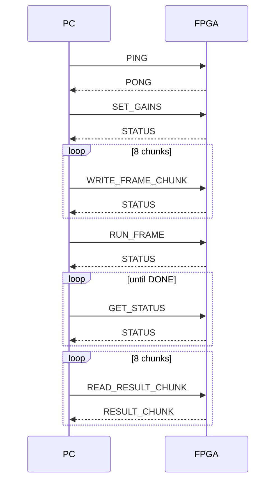

# Protokół UART

Aktualny protokół przesyła pełną ramkę 256 próbek signed int16. Warstwa PC jest
w `tools/uart_frame_protocol.py`, a RTL parser/formatter w `rtl/uart/`.

## Format ramki

```text
SOF CMD SEQ LEN_L LEN_H PAYLOAD CHK EOF
```

| Pole | Znaczenie |
| --- | --- |
| `SOF` | bajt startu `0xA5` |
| `CMD` | identyfikator komendy |
| `SEQ` | numer sekwencyjny, kopiowany do odpowiedzi |
| `LEN_L`, `LEN_H` | długość payload little-endian |
| `PAYLOAD` | dane komendy |
| `CHK` | 8-bit checksum |
| `EOF` | bajt końca `0x5A` |

Checksum to suma modulo 256 pól `CMD`, `SEQ`, `LEN_L`, `LEN_H` i payloadu.

Przykład poprawnej ramki `PING` z `SEQ = 0` i pustym payloadem:

```text
A5 10 00 00 00 10 5A
```

Wyliczenie checksum:

```text
0x10 + 0x00 + 0x00 + 0x00 = 0x10
```

Starsza komenda `A5 01 5A` pozostaje jako legacy test impulsowy i nie jest częścią
pełnego protokołu ramek.

## Komendy i odpowiedzi

| Nazwa | Kod | Kierunek | Payload |
| --- | ---: | --- | --- |
| `PING` | `0x10` | PC -> FPGA | pusty |
| `SET_GAINS` | `0x11` | PC -> FPGA | `bass_i16`, `mid_i16`, `treble_i16` |
| `WRITE_FRAME_CHUNK` | `0x12` | PC -> FPGA | `offset_u16`, `count_u8`, `count` próbek i16 |
| `RUN_FRAME` | `0x13` | PC -> FPGA | pusty |
| `READ_RESULT_CHUNK` | `0x14` | PC -> FPGA | `offset_u16`, `count_u8` |
| `GET_STATUS` | `0x15` | PC -> FPGA | pusty |
| `ERROR` | `0x7F` | FPGA -> PC | `failed_cmd_u8` |
| `PONG` | `0x90` | FPGA -> PC | pusty |
| `RESULT_CHUNK` | `0x94` | FPGA -> PC | `status_u8`, `offset_u16`, `count_u8`, próbki i16 |
| `STATUS` | `0x95` | FPGA -> PC | `status_u8` |

Wszystkie pola 16-bitowe są little-endian. Próbki i gainy są signed int16.

## Payloady szczegółowo

### `PING`

Żądanie:

```text
payload: empty
```

Odpowiedź:

```text
cmd: PONG
payload: empty
```

### `SET_GAINS`

Żądanie:

```text
bass_gain_q2_14   int16 little-endian
mid_gain_q2_14    int16 little-endian
treble_gain_q2_14 int16 little-endian
```

Długość payloadu musi wynosić 6 bajtów. Odpowiedzią jest `STATUS` z jednym
bajtem statusu. Wartości gainów są w formacie signed Q2.14.

### `WRITE_FRAME_CHUNK`

Żądanie:

```text
offset_u16 little-endian
count_u8
sample[0] int16 little-endian
...
sample[count-1] int16 little-endian
```

Payload ma długość `3 + 2 * count`. RTL akceptuje `count` w zakresie
`1..32`, a `offset + count` musi mieścić się w ramce 256 próbek. Poprawny zapis
ustawia status `INPUT_LOADED`.

### `RUN_FRAME`

Żądanie:

```text
payload: empty
```

Jeżeli ramka wejściowa jest załadowana i CPU nie jest zajęty, backend ustawia
request w mailboxie. Odpowiedzią jest `STATUS`. Akcelerator nie jest uruchamiany
bezpośrednio przez UART; request obsługuje mini CPU.

### `GET_STATUS`

Żądanie:

```text
payload: empty
```

Odpowiedzią jest `STATUS` z jednym bajtem statusu.

### `READ_RESULT_CHUNK`

Żądanie:

```text
offset_u16 little-endian
count_u8
```

Jeżeli `DONE` jest ustawione i zakres jest poprawny, odpowiedzią jest
`RESULT_CHUNK`:

```text
status_u8
offset_u16 little-endian
count_u8
sample[0] int16 little-endian
...
sample[count-1] int16 little-endian
```

Odczyt przed `DONE` zwraca `ERROR` dla komendy `READ_RESULT_CHUNK`.

## Status flags

Status jest jednym bajtem.

| Bit | Maska | Nazwa | Znaczenie |
| ---: | ---: | --- | --- |
| 0 | `0x01` | `INPUT_LOADED` | w mailboxie jest ramka wejściowa |
| 1 | `0x02` | `CPU_BUSY` | mini CPU/backend jest w trakcie obsługi |
| 2 | `0x04` | `DONE` | wynik jest gotowy |
| 3 | `0x08` | `ERROR` | błąd komendy albo przetwarzania |
| 4 | `0x10` | `TIMEOUT` | timeout zgłoszony w ścieżce statusu |

## Sekwencja transakcji



## Błędy

Obsługiwane albo reprezentowane przypadki błędów:

- zły `EOF`,
- zła suma kontrolna,
- payload dłuższy niż limit parsera RTL,
- nieobsługiwana komenda,
- błędna długość payloadu,
- `WRITE_FRAME_CHUNK` z zakresem poza ramką,
- `READ_RESULT_CHUNK` z zakresem poza ramką,
- `READ_RESULT_CHUNK` przed `DONE`,
- `RUN_FRAME` bez załadowanej ramki albo gdy CPU jest zajęty.

Część błędów parsera, na przykład brak poprawnego `SOF`, może skutkować brakiem
odpowiedzi i timeoutem po stronie PC. Dokładne zachowanie zależy od miejsca,
w którym błąd zostanie wykryty: parser ramek, backend mailboxa albo transport PC.
