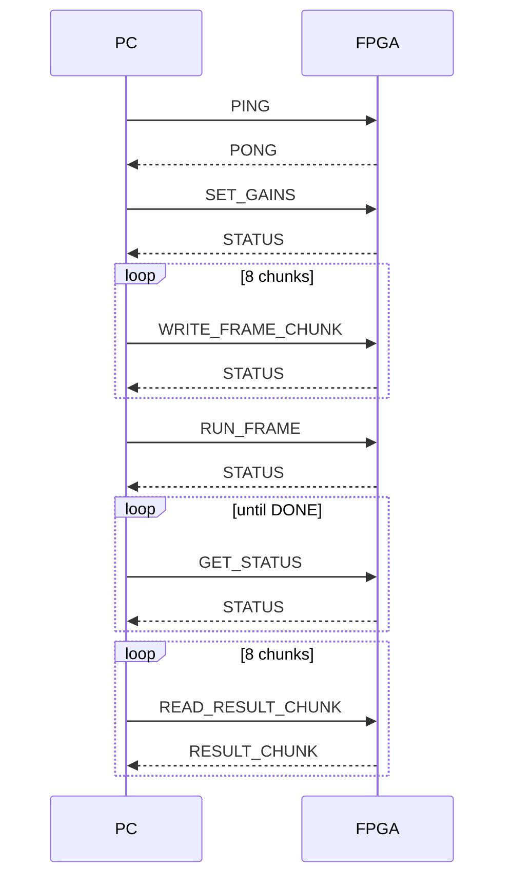

# Protokół UART

Aktualny protokół przesyła pełną ramkę 256 próbek signed int16. Warstwa PC jest w
`tools/uart_frame_protocol.py`, a RTL parser/formatter w `rtl/uart/`.

## Format ramki

```text
SOF CMD SEQ LEN_L LEN_H PAYLOAD CHK EOF
```

| Pole | Znaczenie |
| --- | --- |
| `SOF` | bajt startu `0xA5` |
| `CMD` | identyfikator komendy |
| `SEQ` | numer sekwencyjny |
| `LEN_L`, `LEN_H` | długość payload little-endian |
| `PAYLOAD` | dane komendy |
| `CHK` | 8-bit checksum |
| `EOF` | bajt końca `0x5A` |

Checksum to suma modulo 256 pól `CMD`, `SEQ`, długości i payloadu.

## Komendy

| Komenda | Kod | Rola |
| --- | ---: | --- |
| `PING` | `0x10` | test łączności |
| `SET_GAINS` | `0x11` | zapis `bass`, `mid`, `treble` Q2.14 |
| `WRITE_FRAME_CHUNK` | `0x12` | zapis fragmentu ramki wejściowej |
| `RUN_FRAME` | `0x13` | żądanie przetwarzania przez mini CPU |
| `READ_RESULT_CHUNK` | `0x14` | odczyt fragmentu wyniku |
| `GET_STATUS` | `0x15` | odczyt statusu |
| `ERROR` | `0x7F` | odpowiedź błędu |
| `PONG` | `0x90` | odpowiedź na `PING` |
| `RESULT_CHUNK` | `0x94` | odpowiedź z próbkami wyniku |
| `STATUS` | `0x95` | odpowiedź statusowa |

Starsza komenda `A5 01 5A` pozostaje jako legacy test impulsowy i nie jest częścią
pełnego protokołu ramek.

## Transfer próbek

Ramka ma 256 próbek signed int16. Próbki są przesyłane little-endian. Dla
stabilnego payloadu UART ramka jest dzielona na osiem chunków po 32 próbki:

```text
WRITE_FRAME_CHUNK offset=0   count=32
WRITE_FRAME_CHUNK offset=32  count=32
...
WRITE_FRAME_CHUNK offset=224 count=32
```

## Sekwencja transakcji



## Status flags

Status jest jednym bajtem. Najważniejsze flagi:

- `INPUT_LOADED` - ramka wejściowa została załadowana,
- `CPU_BUSY` - mini CPU lub backend przetwarza żądanie,
- `DONE` - wynik jest gotowy,
- `ERROR` - błąd transakcji lub przetwarzania,
- `TIMEOUT` - przekroczono limit czasu w logice statusu.

Backend UART nie steruje bezpośrednio akceleratorem. Ustawia request w mailboxie,
a akcelerator uruchamia wyłącznie mini CPU.
